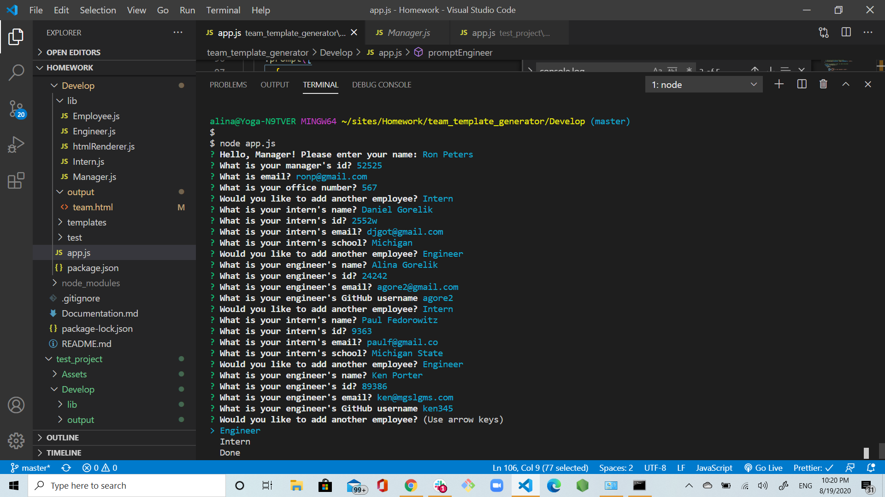
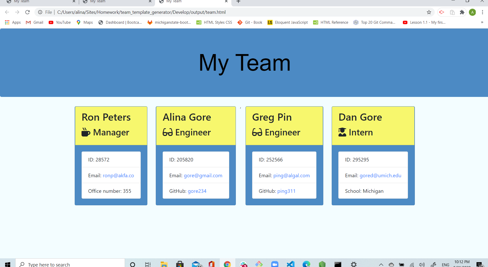

# Title

Team Template Generator

## Description

This application will allow manager to generate a web page that displays his team member's profiles.

## Usage

The application will dynamically generate an HTML file with the info based on manager's responses. The info for each team member will include name, email, employee id, github (for engineers), school (for interns) and other relevant info. The app will help manager to quickly access emails and GitHub profiles of the team members.

## Functionality

The app is a software engineering team generator command line application. The application will prompt the user for information about the team manager and then information about the team members. The user can input any number of team members, and they may be a mix of engineers and interns. When the user has completed building the team, the application will create an HTML file that displays a nicely formatted team roster based on the information provided by the user.

## Pictures of Team Template Generator

## Installation

In the command line of the working directory, type "npm install" to install inquirer, util and fs.

## GitHub Repository

https://github.com/agorelik2/team_template_generator

## Link to the deployed application

https://agorelik2.github.io/team_template_generator/
